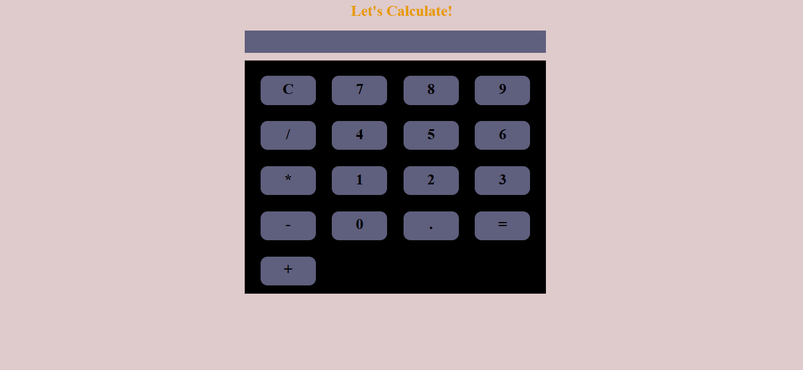

Calculator Web App 🧮

A simple, responsive calculator web app built using HTML, CSS, and JavaScript. This app supports basic arithmetic operations and is designed to mimic the look and feel of a physical calculator.

 📸 Preview

 🛠️ Built With

- HTML5
- CSS3 (Flexbox/Grid)
- Vanilla JavaScript

✨ Features

- Perform basic calculations: Addition, Subtraction, Multiplication, Division
- Responsive design for all screen sizes
- Clear functionalities
- Decimal support
